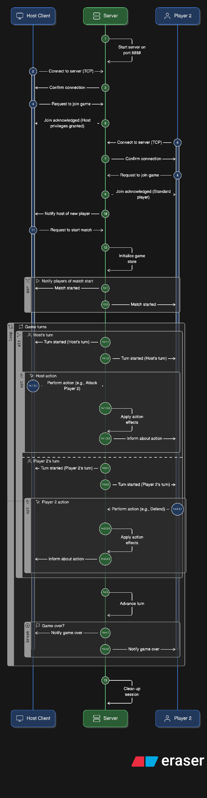

# Armada: Multiplayer Strategy Game Documentation

## 1. Project Overview

**Armada** is a terminal-based (TUI), turn-based multiplayer strategy game written in C and C++. It features a custom TCP/UDP networking engine, a threaded server architecture, and a reactive client interface built with `FTXUI`.

The game revolves around managing a planet's economy ("Stars"), upgrading ships, and attacking opponents to become the richest empire.

---

## 2. Architecture & Networking

The system uses a **Client-Server** architecture.

### 2.1 Network Protocol
*   **Transport:** TCP for reliable game state synchronization; UDP for LAN server discovery.
*   **Data Format:** Binary structs defined in `include/common/events.h`.
*   **Platform:** Cross-platform compatibility (Windows via Winsock, Linux/Unix via BSD sockets) handled in `net_platform.h`.

### 2.2 Server Structure (`src/server/`)
The server is multi-threaded:
1.  **Main Thread:** Manages the lifecycle and logging.
2.  **Accept Thread:** Listens for new TCP connections.
3.  **Discovery Thread:** Listens for UDP broadcast packets (`ARMADA_DISCOVER_V1`) and responds with server details.
4.  **Client Threads:** One thread per connected player to handle blocking reads.

### 2.3 Client Structure (`src/client/`)
The client uses a hybrid threaded model:
1.  **UI Thread:** Renders the TUI and captures user input.
2.  **Pump Thread:** Polls the socket for incoming game events (`client_pump`).
3.  **Scan Thread:** Periodically broadcasts UDP packets to find LAN servers.

---

## 3. Game State & Logic

### 3.1 Entities
*   **Planet:** The source of income.
    *   **Health:** Income scales based on current Health (damaged planets produce less). Health can go negative.
    *   **Income:** Stars gained per turn. Income scales based on current Health (damaged planets produce less).
*   **Ship:** The offensive unit.
    *   **Damage:** The amount of Health removed from an enemy planet during an attack.
*   **Stars:** The currency used for actions.

### 3.2 Win Conditions
**Economic Victory:** Accumulate `STAR_GOAL` (1000) Stars.

### 3.3 The Turn Cycle
The game is strictly turn-based.
1.  **Turn Start:** Server calculates income for the current player based on their planet's health.
2.  **Notification:** Server sends `EVENT_TURN_STARTED` to all clients.
3.  **Action:** The current player sends a `USER_ACTION`.
4.  **Resolution:** Server validates the action, updates state, checks for Game Over, and advances to the next player.

---

## 4. Event System (`events.h`)

Communication is driven by the `GameEvent` structure. Below is the flow of events:

### 4.1 Connection & Lifecycle
| Event Type | Direction | Description |
| :--- | :--- | :--- |
| `EVENT_PLAYER_JOIN_REQUEST` | Client -> Server | Sent immediately upon TCP connection with Player Name. |
| `EVENT_PLAYER_JOIN_ACK` | Server -> Client | Contains success status, assigned Player ID, and Host ID. |
| `EVENT_PLAYER_JOINED` | Server -> All | Notification that a new player has entered the lobby. |
| `EVENT_HOST_UPDATED` | Server -> All | Sent when the lobby host changes (e.g., previous host left). |
| `EVENT_MATCH_START` | Server -> All | Sent when Host initiates the game. Contains full initial state. |

### 4.2 Gameplay Flow
| Event Type | Direction | Description |
| :--- | :--- | :--- |
| `EVENT_TURN_STARTED` | Server -> All | Signals whose turn it is. Contains a snapshot of the game state (`PlayerGameState`) specifically filtered for the viewer (Fog of War logic). |
| `EVENT_USER_ACTION` | Client -> Server | A command to perform an action (Attack, Repair, etc.). |
| `EVENT_STAR_THRESHOLD_REACHED`| Server -> All | Warning sent when a player crosses 900 Stars (close to victory). |
| `EVENT_GAME_OVER` | Server -> All | Sent when a winner is determined. |

---

## 5. Controls & User Interface

The UI is divided into two main tabs: **Host** and **Play**.

### 5.1 Host Tab
Allows a user to run a server instance on their local machine.
*   **Start Server:** Binds to Port 8080 and starts the background listener threads.
*   **Stop Server:** Disconnects all clients and shuts down threads.
*   **Logs:** Displays server-side activity (connections, errors).

### 5.2 Play Tab
Split into two views: **Join Server** and **Game Session**.

#### Join View
*   **Player Name:** Input field to set your display name.
*   **Manual IP:** Input field to connect to a specific IP address.
*   **LAN List:** A list of auto-discovered servers on the local network.
*   **Search Now:** Manually triggers a UDP broadcast to refresh the LAN list.
*   **Join Selection/Manual:** Initiates the TCP connection.

#### Game Session View
Once connected, this view is active.
*   **Lobby Area:** Shows connected players.
*   **Start Match:** (Host Only) Begins the game.
*   **Gameplay Indicators:**
    *   **"Your Turn":** Appears in Green when it is your move.
    *   **Stats:** Shows your Stars, HP, and Ship stats.
*   **Actions:** (Contextual buttons enabled during your turn)
    *   **Attack:** Opens a dialog to select a target player.
    *   **Repair:** Spend stars to heal your planet.
    *   **Upgrade Planet:** Spend stars to increase max HP/Income.
    *   **Upgrade Ship:** Spend stars to increase damage.

---

## 6. Development Guide

### 6.1 Adding a New Action
1.  **Update Enum:** Add entry to `UserActionType` in `game_types.h`.
2.  **Update Validation:** Add logic to `server_compute_valid_actions` in `server.c`.
3.  **Implement Logic:** Add handling logic in `server_on_turn_action` (currently a stub in `main.c` that needs to be expanded to modify `GameState`).
4.  **UI Binding:** Add a button in `launcher.cpp` that calls `client_send_action` with the new enum.

### 6.2 Visualizing State
The server sends a `PlayerGameState` snapshot. This structure handles information hiding:
*   **Self:** You see your exact stats.
*   **Others:** You see `PlayerPublicInfo`.
    *   **Stars:** Hidden unless they cross the warning threshold.
    *   **Health:** Coarse percentage (25%, 50%, 75%, 100%) rather than exact integer values to simulate "Fog of War".

### 6.3 Code Map
*   **Entry Point:** `src/main.cpp` calls `armada_tui_run`.
*   **UI Logic:** `src/client/launcher.cpp` contains the FTXUI definitions.
*   **Server Logic:** `src/networking/server.c` handles the core state machine.
*   **Client Logic:** `src/networking/client.c` handles event deserialization and callback dispatch.

## 7. Life Cycle Diagram



## 8. Data Types & Network Payloads

This section details the binary structures used for game logic and network communication, primarily defined in `include/common/game_types.h` and `include/common/events.h`.

### 8.1 Enumerations

#### `UserActionType`
Defines the specific actions a player can take during their turn.
| Value | Symbol | Description |
| :--- | :--- | :--- |
| 0 | `USER_ACTION_NONE` | No action / Null state. |
| 1 | `USER_ACTION_END_TURN` | Pass turn to the next player. |
| 2 | `USER_ACTION_ATTACK_PLANET` | Attack an opponent's planet using the ship. |
| 3 | `USER_ACTION_REPAIR_PLANET` | Spend stars to restore planet health. |
| 4 | `USER_ACTION_UPGRADE_PLANET` | Spend stars to increase Income and Max Health. |
| 5 | `USER_ACTION_UPGRADE_SHIP` | Spend stars to increase Ship Base Damage. |

#### `EventType`
Identifies the intent of a `GameEvent` packet.
| Symbol | Description |
| :--- | :--- |
| `EVENT_PLAYER_JOIN_REQUEST` | Client requesting to enter the lobby. |
| `EVENT_PLAYER_JOIN_ACK` | Server response to a join request. |
| `EVENT_PLAYER_JOINED` / `LEFT` | Notification that a peer has connected/disconnected. |
| `EVENT_MATCH_START` | The host has initiated the game. |
| `EVENT_TURN_STARTED` | A new turn has begun; contains the latest game state snapshot. |
| `EVENT_USER_ACTION` | A player has performed a game command. |
| `EVENT_STAR_THRESHOLD_REACHED` | A player is close to an economic victory. |
| `EVENT_GAME_OVER` | The match has ended. |

---

### 8.2 Core Game Structures

These structures represent the state of the game world.

#### `PlanetStats` & `ShipStats`
Basic entity attributes.
*   **Planet:** `level`, `max_health`, `current_health`, `base_income`.
*   **Ship:** `level`, `base_damage`.

#### `PlayerState` (Server-Side)
The authoritative record of a player.
```c
typedef struct {
    int player_id;
    char name[32];
    int is_active;          // 1 if in game, 0 if empty slot
    int is_connected;       // 1 if socket open, 0 if disconnected
    int stars;              // Current currency
    PlanetStats planet;
    ShipStats ship;
    // ...
} PlayerState;
```

#### `PlayerPublicInfo` (Client-Side / Fog of War)
A sanitized version of a player's state sent to opponents to hide secret information.
*   **`coarse_planet_health`**: Integer (0, 25, 50, 75, 100). Hides exact HP values.
*   **`show_stars`**: Boolean (0 or 1). Only 1 if the opponent is near the winning threshold.

#### `PlayerGameState`
The specific "View" sent to a client every turn.
```c
typedef struct {
    int viewer_id;                    // The ID of the player receiving this struct
    PlayerState self;                 // Full info of the receiving player
    PlayerPublicInfo entries[4];      // Sanitized info of all other players
} PlayerGameState;
```

---

### 8.3 The Main Event Packet

All network traffic over TCP uses this single wrapper structure.

#### `GameEvent`
```c
typedef struct {
    EventType type;      // What this event is
    int sender_id;       // Who sent it (-1 for Server, 0-3 for Players)
    time_t timestamp;    // When it happened

    // Union of all possible payloads.
    // Only the struct corresponding to 'type' is valid.
    union {
        EventPayload_PlayerJoin join_req;
        EventPayload_JoinAck join_ack;
        EventPayload_PlayerLifecycle player_event;
        EventPayload_TurnInfo turn;
        EventPayload_UserAction action;
        EventPayload_MatchStart match_start;
        EventPayload_HostUpdate host_update;
        EventPayload_Threshold threshold;
        EventPayload_GameOver game_over;
        EventPayload_Error error;
    } data;
} GameEvent;
```

---

### 8.4 Event Payloads

These structs populate the `union` inside `GameEvent` depending on the `type`.

#### Connection Payloads
*   **`EventPayload_PlayerJoin`**
    *   `player_name`: The requested display name.
*   **`EventPayload_JoinAck`**
    *   `success`: 1 if joined, 0 if server full.
    *   `player_id`: The ID assigned to the client (0-3).
    *   `host_player_id`: The ID of the current lobby host.
    *   `is_host`: 1 if the joining player is now the host.
*   **`EventPayload_HostUpdate`**
    *   `host_player_id`: ID of the new host.
    *   `host_player_name`: Name of the new host.

#### Gameplay Payloads
*   **`EventPayload_MatchStart`**
    *   `state`: A copy of the full `GameState` at turn 0.
*   **`EventPayload_TurnInfo`** (The heartbeat of the game)
    *   `current_player_id`: Whose turn it is.
    *   `next_player_id`: Who goes next.
    *   `turn_number`: Global turn counter.
    *   `valid_actions`: **Bitmask** (integer) representing buttons the UI should enable.
        *   Check via: `if (valid_actions & VALID_ACTION_ATTACK_PLANET) ...`
    *   `last_action`: A copy of the action that caused this turn update (e.g., "Player 1 attacked Player 2").
    *   `game`: The `PlayerGameState` snapshot (the board state).
*   **`EventPayload_UserAction`**
    *   `action_type`: Enum `UserActionType`.
    *   `target_player_id`: ID of victim (for attacks).
    *   `value`: Numerical magnitude (e.g., damage dealt, stars spent).
    *   `metadata`: Extra generic field for future expansion.

#### Game End / Notifications
*   **`EventPayload_Threshold`**
    *   `player_id`: Who crossed the line.
    *   `threshold`: The value crossed (e.g., 900 stars).
*   **`EventPayload_GameOver`**
    *   `winner_id`: ID of the victor.
    *   `reason`: String text (e.g., "Victory", "Star goal reached").
*   **`EventPayload_Error`**
    *   `error_code`: Numeric error ID.
    *   `message`: Human-readable error string.